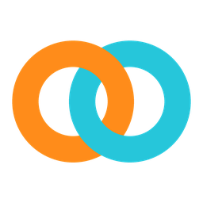
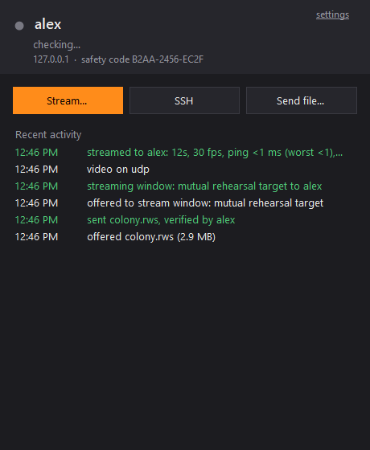
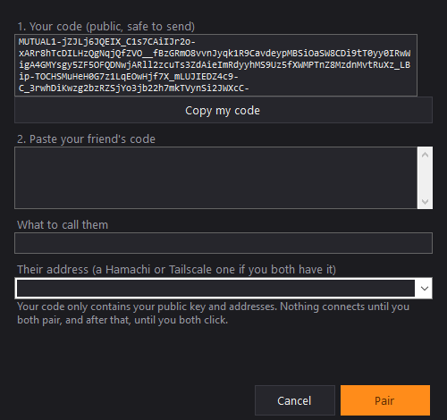

<p align="center">
  
</p>

<h1 align="center">Mutual</h1>

<p align="center">
  Screen sharing, remote play, file sending and SSH for two friends.<br>
  Nothing connects until both of you say yes.
</p>

<p align="center">
  <a href="https://github.com/NubzParmesan/mutual/actions/workflows/build.yml"></a>
  
  
  <a href="LICENSE"></a>
</p>

<p align="center">
  
  &nbsp;
  
</p>

## WHY

My friend and I wanted to play RimWorld together. The multiplayer mod desynced every time, so we ended up running a pile of separate tools: Parsec for the picture, Hamachi for the connection, a hacked together second mouse, and some PowerShell scripts for SSH. It worked, kind of, but it was a mess.

Mutual is all of that in one app. The one rule it's built around is that **nothing happens on your PC unless you clicked yes on your PC**. A request only asks. Streaming, control, files and SSH all wait for the other person to accept.

## WHAT IT DOES

- **Stream** a whole screen, one window (even with other windows on top of it), or a box you drag and resize while it's live
- **Let your friend play.** Every stream starts watch only. Click **Let them control** on the bar at the top of your screen and their mouse and keyboard work on whatever you're sharing, and only on that. **Ctrl+Alt+End** takes it back from anywhere. Your cursor shows up on their side too
- **Sound** comes through with the picture, compressed with Opus
- **Send files** straight to their Downloads, checked on arrival so a damaged file never shows up
- **SSH** that only turns on while you're both connected and turns itself back off after
- **Play RimWorld together** in one click with the SplitColony mod: the screen splits, your friend gets the right half with their own mouse, and you keep yours
- **Reconnects on its own** if the connection drops in the middle of a stream
- Clipboard sharing if you both turn it on, a summary of every session (time, fps, ping, loss), and a tray icon that shows when your friend is online

## HOW PRIVATE IS IT

- You pair once by swapping codes. A code only holds a public key and some addresses, so it's safe to paste in Discord. Afterwards you both read the same safety code out loud, and Mutual won't pair until you say it matched. If the key ever changes without you pairing again, Mutual warns you
- Every connection between the two PCs is encrypted, and each side only accepts the one key it paired with
- There's no account and no cloud. The optional rendezvous server (for when you're not on the same VPN) only ever sees an id and encrypted bytes. It can't read anything, and requests going through it are signed so it can't fake one either
- Invites that keep getting ignored stop popping up for a while, and the Accept button ignores clicks for the first second so a mid game click can't hit it
- Received files are marked the same way browser downloads are, so Windows asks before running one, and files that can run code get a warning before you accept
- The activity list shows what happened on your own PC. Never command history, file contents or what was on screen. You can clear it from the tray menu

## GETTING STARTED

1. Download `Mutual.exe` from [Releases](https://github.com/NubzParmesan/mutual/releases) and run it. It checks itself against the checksum on the release, then installs into Program Files with Start menu and desktop shortcuts (one admin prompt). Program Files is on purpose: nothing else on your PC can swap it out there
2. Click **Pair with a friend**, copy your code and send it to them, then paste theirs
3. Read the safety code to each other
4. Click **Set up** once so Windows lets your friend reach Mutual (one admin prompt, and the firewall rules only allow your friend's address)
5. Hit **Stream** and pick what to share

It works best when you're both on the same VPN (Hamachi, Tailscale, whatever) or the same network. If you're not, put a rendezvous server in Settings. Mutual tries to open its port on your router, and if that doesn't work it relays through the server.

## CHECKING A DOWNLOAD

Every release is built by GitHub Actions straight from this repo, with a `Mutual.exe.sha256` next to the exe and a signed record of which commit and workflow built it. To check a copy yourself:

```
gh attestation verify Mutual.exe --repo NubzParmesan/mutual
```

The build pins every action to an exact commit and every package to an exact version, so a change upstream can't sneak into a release.

## HOW IT WORKS

| | |
|---|---|
| **Capture** | DXGI Desktop Duplication for screens and boxes, Windows Graphics Capture for single windows |
| **Video** | Hardware H.264 through Media Foundation (NVIDIA, AMD or Intel), low latency, constant bitrate |
| **Transport** | Video over UDP with Reed-Solomon parity, so a few lost packets get rebuilt instead of freezing the picture. Falls back to TCP if UDP is blocked |
| **Security** | Pinned mutual TLS for the link, input and everything else. AES-GCM for the UDP packets, keyed through the TLS link |
| **Sound** | WASAPI loopback, Opus at about 90 kbit/s |
| **Adapts** | Bitrate backs off when the connection fills up and creeps back when it clears. Parity grows with the loss the viewer reports |

Some numbers from testing on one PC:

- **About 19 ms** from something being drawn on the host to it being decoded on the viewer. The network adds whatever your ping is
- **0 frames lost** with 25% of video packets thrown away on purpose, once the parity caught up
- Encoding a frame takes about 2 ms on an RTX card, decoding about 0.2 ms

## BUILDING IT

You need the .NET 8 SDK on Windows.

```
dotnet build Mutual.sln
dotnet test tests/Mutual.Core.Tests
deploy/publish.sh                      # one file Mutual.exe in publish/
```

| Folder | What's in it |
|---|---|
| `src/Mutual` | The app: windows, tray, pairing, settings, SSH |
| `src/Mutual.Core` | The connection side: pairing, TLS links, requests, file transfer, rendezvous, firewall |
| `src/Mutual.Stream` | Everything streaming: capture, encode, decode, UDP lane, sound, input, the viewer |
| `tools/Mutual.Rendezvous` | The rendezvous server. Runs anywhere with .NET 8: `dotnet run --project tools/Mutual.Rendezvous -- 28810` |
| `tools/Mutual.Lab` | Tests that run the real thing on one PC: streaming, input, sound, latency, and a full rehearsal with two copies of Mutual paired with each other |
| `tests` | The automated tests |

## COMING FROM MUTUAL SSH

If you used the older Mutual SSH scripts, Mutual picks up that pairing by itself and you don't have to pair again. The **Set up** button switches you over from the old notifier. Mutual also still speaks the old SSH protocol, so if your friend hasn't switched yet it works anyway.

## LICENSE

MIT. Mutual uses [Concentus](https://github.com/lostromb/concentus) for Opus and [Vortice.Windows](https://github.com/amerkoleci/Vortice.Windows) for DirectX. Their licenses are in [THIRD_PARTY_NOTICES.txt](THIRD_PARTY_NOTICES.txt).
